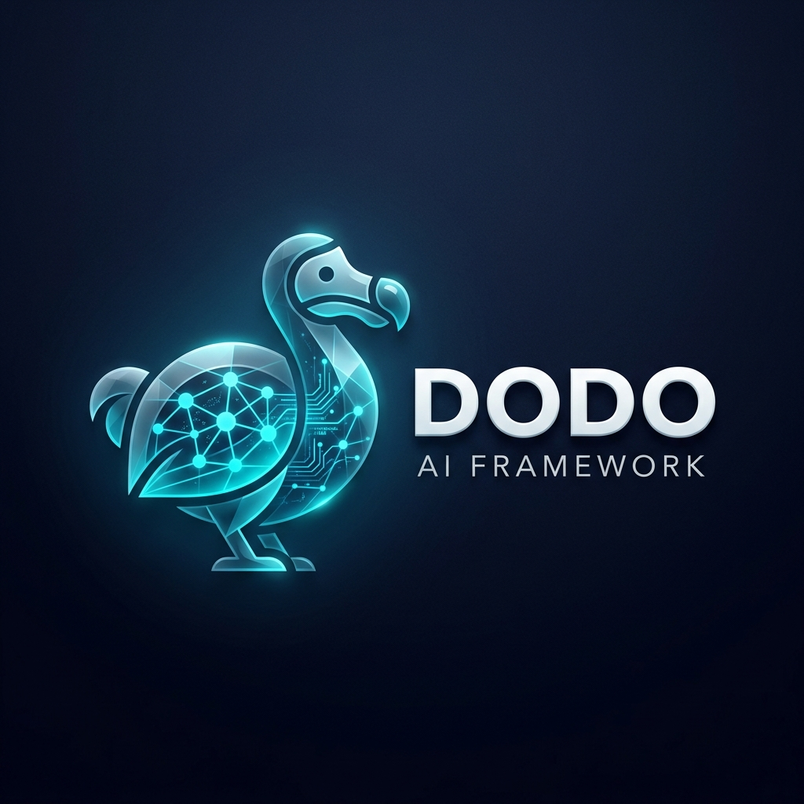

<div align="center">
  
  <h1>Dodo</h1>
  <p><b>Institutional-Grade AI Agent Framework with Persistent Memory & Self-Improvement</b></p>

  [](https://opensource.org/licenses/Apache-2.0)
  [](https://www.python.org/downloads/)
  [](#features)
  [](#)
</div>

---

## 🚀 Overview

**Dodo** is a powerful, enterprise-ready framework designed for building autonomous AI agents that don't just "talk"—they **remember, learn, and evolve**. By bridging the gap between short-term context and long-term intelligence, Dodo enables agents to maintain a consistent persona and knowledge base across millions of interactions.

### Why Choose Dodo?

- **🧠 Infinite Memory**: State-of-the-art archival and recall memory systems that scale with your data.
- **🔄 Recursive Self-Improvement**: Agents can autonomously update their own memory blocks and skill sets.
- **🛡️ Institutional Security**: Hardened with AES-256 GCM encryption for sensitive data and multi-tenant isolation.
- **🔌 Universal Integration**: Model-agnostic architecture supporting OpenAI, Anthropic, Google, and local LLMs via vLLM or Ollama.
- **⚡ High Performance**: Polyglot bridge support for sub-millisecond risk evaluation and audit logging.

---

## ✨ Key Features

| Feature | Description |
| :--- | :--- |
| **Persistent Identity** | Agents maintain a stable core persona and "human" memory. |
| **Custom Tools** | Inject any Python function as a first-class capability for your agent. |
| **Model Agnostic** | Switch between GPT-4o, Claude 3.5, and Gemini 1.5 with zero code changes. |
| **Auto-Summarization** | Intelligent context management to prevent token overflow. |
| **Multi-Tenant** | Native support for Organizations, Users, and Projects. |

---

## 🛠️ Quick Start

### 1. Installation

Dodo is designed to be lean and modular. Install the core framework using `pip`:

```bash
# Clone and install locally
git clone https://github.com/Monkey0-9/dodo.git
cd dodo
pip install -e .
```

### 2. Basic Agent Initialization

```python
import asyncio
from dodo.client.client import DodoClient

async def main():
    client = DodoClient()
    
    # Create an agent with long-term memory
    agent = await client.create_agent(
        name="Dodo-Core",
        persona="You are an expert quantitative analyst with access to institutional data.",
        human="I am your operator. We are building the next generation of AI trading."
    )
    
    # Engage in a memory-aware conversation
    response = await agent.send_message("Let's analyze the current market regime.")
    print(f"Dodo: {response.message}")

if __name__ == "__main__":
    asyncio.run(main())
```

---

## 📊 Roadmap

- [x] Full Project Rebranding & Sanitization
- [x] SQLite & PostgreSQL Dual-Engine Support
- [x] Distributed Memory Vector Search (Pinecone Integration)
- [x] Real-time Streaming WebSocket API
- [x] Dodo Portal (Admin UI Dashboard)

---

## 📄 License

This project is licensed under the Apache 2.0 License - see the [LICENSE](LICENSE) file for details.

<div align="center">
  <sub>Built with ❤️ by the Dodo Intelligence Team</sub>
</div>
